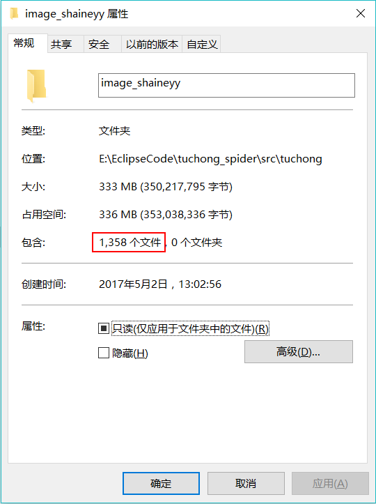
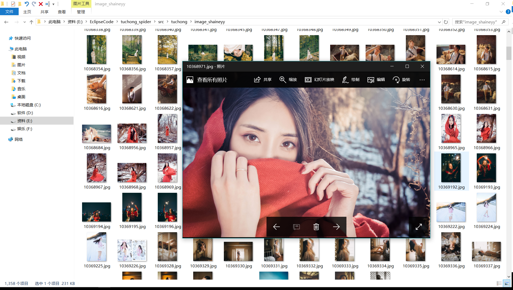
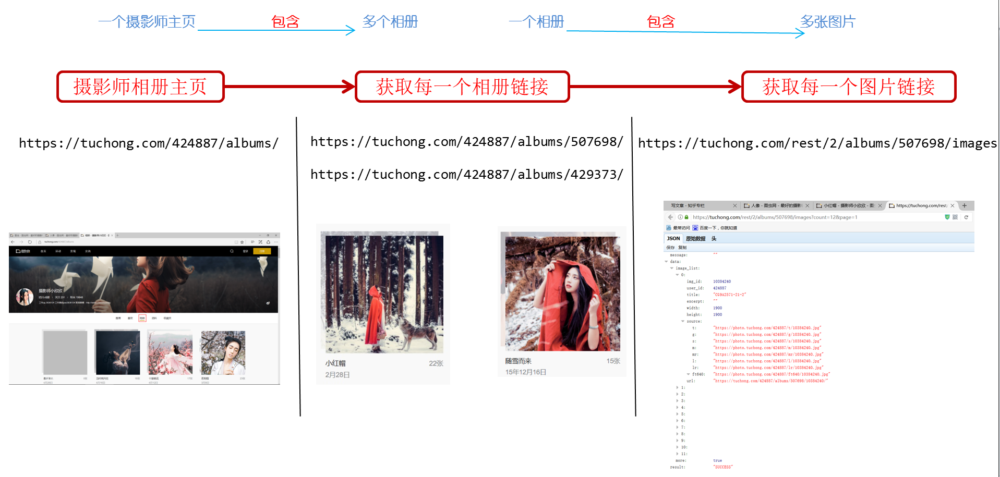

# tuchong-Spider
利用Python下载图虫网摄影作品

## **一、结果预览**
### **下载结果**

## **二、爬虫流程**

### **运行环境**
Python:2.7.13

## **三、鸣谢**

[慕课网-爬虫视频教学](http://www.imooc.com/learn/563)

[图虫-摄影师主页](https://tuchong.com/424887/albums/)

